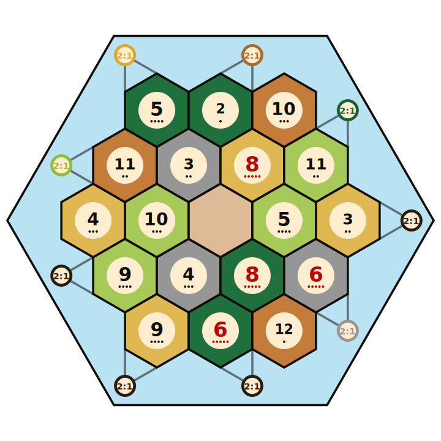

# Catan Analysis Project (WIP)

- [Catan](https://en.wikipedia.org/wiki/Catan) is a popular board game. The game is played on an island composed of hexagonal hexes, with the aim of collecting and spending resources to expand ones settlements.
- The board on which the game is played is randomised each game, and there's an astronomical number of possible boards. 
- Some aims I'm hoping to achieve in this project:
	- Quantify the number of possible, legal boards.
	- Create a program to generate nice SVG visual representations of the board (see below).
	- Create a set of metrics that, according to some standard, provide an index for how 'fair' or 'balanced' a particular board is.
- Explore the (very early stage) work by clicking on the binder link below.

```
[](https://mybinder.org/v2/gh/jackhiggins458/Catan_Analysis/HEAD?labpath=https%3A%2F%2Fgithub.com%2Fjackhiggins458%2FCatan_Analysis%2Fblob%2Fmain%2Fcatan.ipynb)
```


